# B2B Sales Automation


## TL;DR

**Problem:** Sales reps spend only 28% of their time selling – the rest goes to admin tasks.
**Solution:** Hybrid AI – deterministic workflows for reports, probabilistic assistant for analysis.
**Result:** 2.5h/week saved, 938× ROI.

[📊 Demo](#what-i-built) • [🔍 Development Story](./docs/JOURNEY.md) • [⚖️ Tool Comparison](./docs/TOOL-COMPARISON.md)

---

## My Solution: Hybrid Architecture

| Use Case | Architecture | Why? |
|----------|--------------|------|
| Weekly Reports | **Deterministic** (Workflow) | Identical format, auditable, no hallucinations |
| Ad-hoc Analysis | **Probabilistic** (Assistant) | Flexible interpretation, context-dependent |

```
Accounts (WHO)   +   Invoices (HOW)   +   Tickets (HAPPY?)
                         ↓
            Priority Score: Top 3 accounts this week
```

---

## What I Built

### Workflow: Weekly Sales Report

Every Monday 9:00 AM. Identical output for identical data.

```mermaid
flowchart LR
    Trigger((Mon 9:00)) --> FileA[📄 accounts.csv]
    Trigger --> FileB[📄 invoices.csv]
    Trigger --> FileC[📄 tickets.csv]

    FileA --> Check{JS Validation}
    FileB --> Check
    FileC --> Check

    Check -- ✓ OK --> Agent[Agent: Analyze &<br/>Rank Top 3]
    Check -- ✗ Fail --> Stop[❌ Alert]
    Agent --> Output[📧 Email Report]

    style Agent fill:#d4e6f1,stroke:#2980b9,stroke-width:2px
    style Output fill:#d5f5e3,stroke:#27ae60,stroke-width:2px
```



<details>
<summary><strong>Screenshot: Workflow Canvas</strong></summary>
<p align="center">
  
</p>
</details>

<details>
<summary><strong>Screenshot: Email Output</strong></summary>


</details>

### Assistant: Sales Research

User-initiated. Variable interpretation. Same data foundation.

**Example queries:**
- "Show me the top 3 accounts for this week"
- "Which customers have elevated churn risk?"
- "Create a pre-call briefing for TechFlow GmbH"

<details>
<summary><strong>Screenshot: Chat Response</strong></summary>
<p align="center">
  
</p>
</details>

---

## Key Technical Decisions

1. **Fail-Fast Validation:** JS validation runs *before* the LLM call → errors caught at $0 cost
2. **Simulated Data Layer:** CSV files model real API payloads → ready for Salesforce/HubSpot integration

**Key Learning:** 80% of build costs occurred when the Agent executed with bad data. Validate first.

> Deep Dive: [Scoring Logic](./docs/SCORING.md) • [Full Journey](./docs/JOURNEY.md) • [Why LangDock?](./docs/TOOL-COMPARISON.md)

---

## Contact

**Yunus Ishaq** – Sales & AI Enthusiast

[](mailto:yunus@ishaq.de)
[](https://www.linkedin.com/in/yunusishaq/)

---

*December 2025*
